# Haushaltsbuch – Anleitung

Diese Anleitung erklärt, wie du das Haushaltsbuch im Alltag benutzt: Ausgaben erfassen, Kontoauszüge einlesen,
Kassenbons fotografieren, Auswertungen ansehen und planen, wie sich die Kontostände entwickeln.

> Alle Bilder stammen aus einem Beispiel-Haushalt („Familie Muster“) mit ausgedachten Zahlen.

**Inhalt**

1. [Anmelden und zurechtfinden](#1-anmelden-und-zurechtfinden)
2. [Die Übersicht](#2-die-übersicht)
3. [Eine Buchung erfassen](#3-eine-buchung-erfassen)
4. [Buchungen suchen und bearbeiten](#4-buchungen-suchen-und-bearbeiten)
5. [Kontoauszug importieren (CSV)](#5-kontoauszug-importieren-csv)
6. [Einkäufe und Kassenbons](#6-einkäufe-und-kassenbons)
7. [Fixkosten und Daueraufträge](#7-fixkosten-und-daueraufträge)
8. [Kategorien und Regeln](#8-kategorien-und-regeln)
9. [Auswertungen](#9-auswertungen)
10. [Prognose](#10-prognose)
11. [Kredite](#11-kredite)
12. [Für Administratoren: Konten, Familie, Einstellungen](#12-für-administratoren-konten-familie-einstellungen)
13. [Häufige Fragen](#13-häufige-fragen)

---

## 1. Anmelden und zurechtfinden

Öffne die Adresse des Haushaltsbuchs im Browser und melde dich mit deiner E-Mail-Adresse und deinem Passwort an.
Dein Zugang wird von der Person angelegt, die das Haushaltsbuch verwaltet (Administrator).

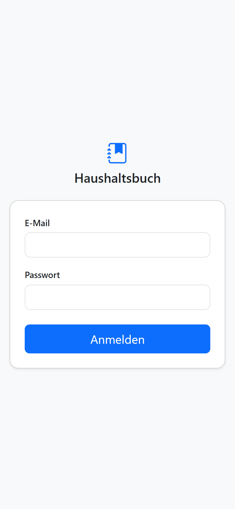

Nach fünf falschen Passwörtern ist der Zugang für 15 Minuten gesperrt. Dein Passwort änderst du selbst unter
**Einstellungen → Mein Passwort ändern**.

### Am Computer

Links steht das Menü mit allen Bereichen. Unter **Verwaltung** findest du Konten, Kategorien, Regeln, Familie und
Einstellungen. Ganz unten wechselst du zwischen hellem und dunklem Design (Symbol ◐) und meldest dich ab.

### Auf dem Handy

Unten gibt es eine Leiste mit **Übersicht**, **Buchungen**, **Einkäufe** und **Mehr**. Über den runden
**+‑Knopf** in der Mitte erfasst du schnell etwas Neues: eine Ausgabe, eine Einnahme, eine Umbuchung, einen Kassenbon,
einen Einkauf, eine PDF-Rechnung, einen Kontoauszug oder Fixkosten. Unter **Mehr** stehen alle übrigen Bereiche.

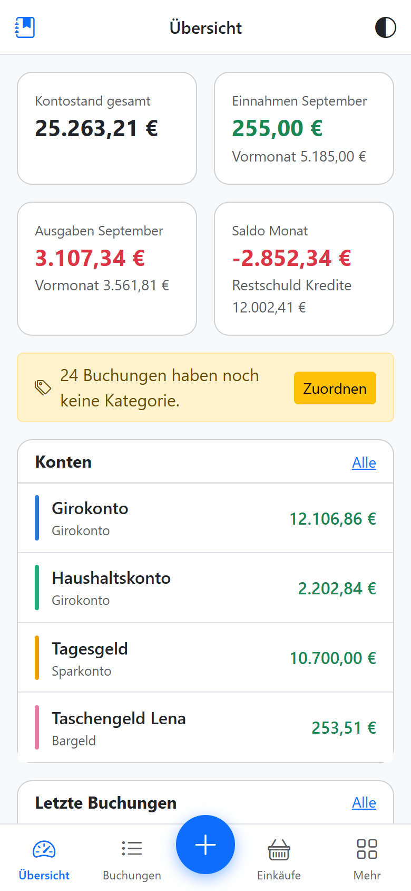 &nbsp;
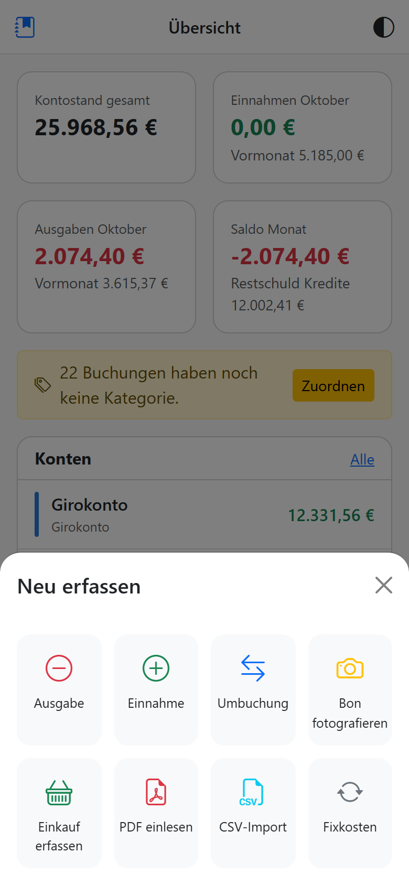 &nbsp;
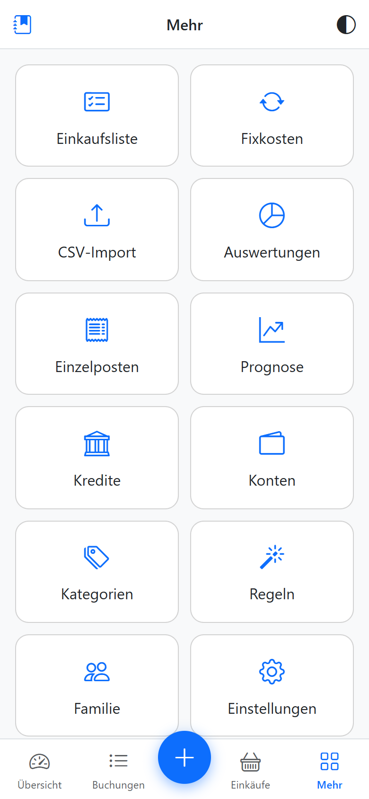

> **Tipp – als App installieren:** Im Handy-Browser über das Menü „Zum Startbildschirm hinzufügen“ (Android: ⋮,
> iPhone: Teilen-Symbol) wählen. Das Haushaltsbuch startet dann wie eine App ohne Adressleiste.

### Wer darf was?

| Rolle | Darf |
|---|---|
| **Administrator** | alles: alle Konten sehen und bebuchen, Konten, Kategorien, Personen und Einstellungen verwalten |
| **Mitglied** | die Konten sehen bzw. bebuchen, die für diese Person freigegeben sind; eigene Regeln anlegen |
| **Kind** | wie Mitglied, aber ohne Regeln zu ändern |

Siehst du ein Konto nicht, das du brauchst, bitte einen Administrator, es für dich freizugeben.

---

## 2. Die Übersicht

Die Startseite zeigt auf einen Blick:

- **Kontostand gesamt**, **Einnahmen** und **Ausgaben** des laufenden Monats (mit Vergleich zum Vormonat) sowie den
  **Saldo** des Monats und die Restschuld von Krediten.
- Einen gelben Hinweis, wenn Buchungen noch **keine Kategorie** haben. Mit **Zuordnen** kommst du direkt zu diesen Buchungen.
- Deine **Konten** mit aktuellem Stand, die **letzten Buchungen**, die **Ausgaben dieses Monats** nach Kategorie,
  eine **Prognose** für die nächsten drei Monate und die **nächsten Fixkosten**.

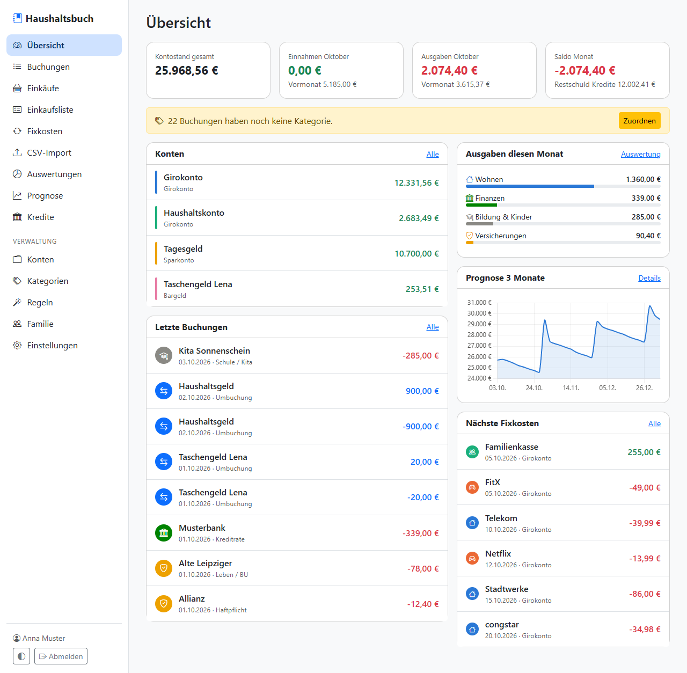

Fast alles ist anklickbar: Ein Konto führt zu seinen Buchungen, „Auswertung“ zu den Auswertungen, „Details“ zur Prognose.

---

## 3. Eine Buchung erfassen

Über **+ → Ausgabe** (Handy) oder **Buchungen → + Buchung** (Computer):

1. Oben die Art wählen: **Ausgabe**, **Einnahme** oder **Umbuchung**.
2. **Betrag** eingeben. Das Vorzeichen setzt das Haushaltsbuch selbst, Ausgaben also ohne Minus eintippen.
3. **Konto**, **Kategorie**, **Datum** und **Empfänger / Geschäft** angeben. Sobald du einen Empfänger eintippst,
   wird eine passende Kategorie vorgeschlagen (z. B. „REWE“ → Lebensmittel).
4. **Speichern**. Mit **Speichern & weitere** bleibt das Formular offen, praktisch zum Nachtragen mehrerer Belege.

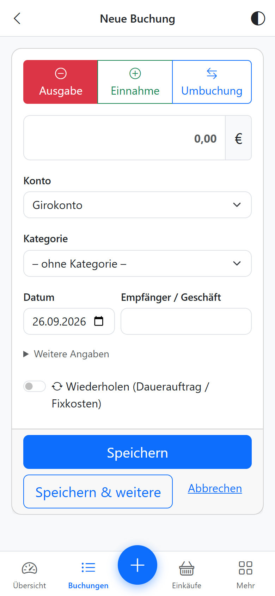 &nbsp;
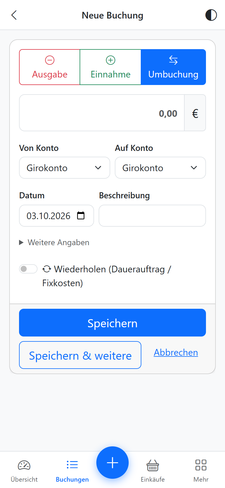

- **Umbuchung** = Geld wandert zwischen zwei eigenen Konten, z. B. vom Girokonto aufs Tagesgeld. Sie zählt weder als
  Einnahme noch als Ausgabe. Machst du aus einer vorhandenen Buchung nachträglich eine Umbuchung und steht die
  Gegenbuchung schon auf dem anderen Konto (z. B. aus dessen Kontoauszug), wird diese übernommen statt doppelt angelegt.
- **Weitere Angaben** öffnet Felder für Verwendungszweck und Notiz.
- **Wiederholen (Dauerauftrag / Fixkosten)**: Ist der Schalter an, wird aus der Buchung gleich eine wiederkehrende Buchung
  (siehe [Fixkosten](#7-fixkosten-und-daueraufträge)).

---

## 4. Buchungen suchen und bearbeiten

Unter **Buchungen** stehen alle Umsätze, nach Tagen gruppiert. Über den Filter oben grenzt du die Liste ein:

- **Konten** antippen, um sie ein- oder auszublenden (Mehrfachauswahl),
- **Suche** nach Empfänger oder Verwendungszweck,
- **Kategorie** (auch „⚠ Ohne Kategorie“), **Art** (Ausgaben, Einnahmen, Umbuchungen, Fixkosten), **Person**,
- **Zeitraum**: dieser/letzter Monat, 3/6/12 Monate, dieses/letztes Jahr oder frei wählbar.

Die Anzahl und die Summen der Einnahmen und Ausgaben unter dem Filter beziehen sich immer auf die gefilterte Liste.

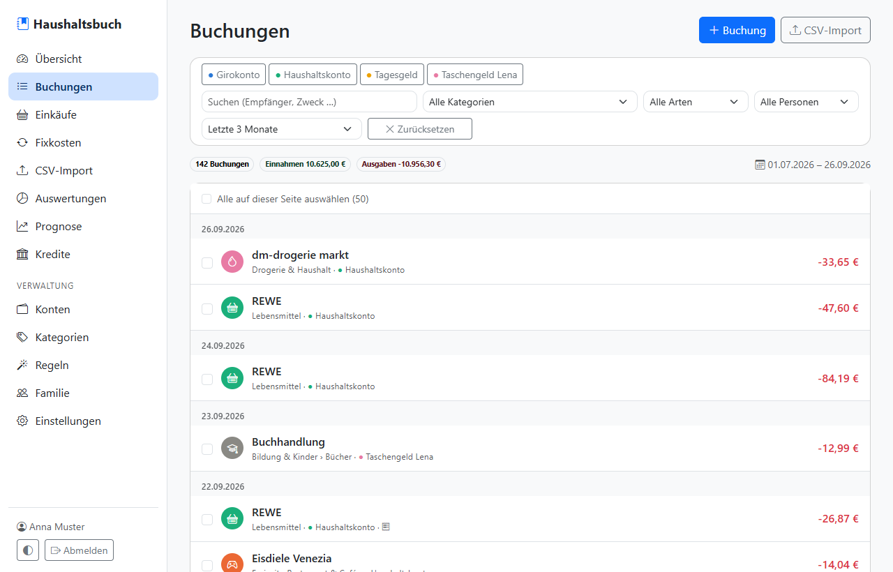

Eine Buchung antippen, um sie zu **bearbeiten** oder zu **löschen**. Buchungen mit dem Symbol 🧾 sind mit einem
Einkauf verknüpft.

**Mehrere Buchungen auf einmal:** Häkchen links setzen (oder „Alle auf dieser Seite auswählen“). Unten erscheint dann eine
Leiste mit den Aktionen **Kategorie zuordnen**, **Anderem Konto zuweisen**, **Als Fixkosten übernehmen** und **Löschen**.

---

## 5. Kontoauszug importieren (CSV)

Statt alles einzutippen, kannst du die Umsätze aus dem Online-Banking übernehmen.

1. Im Online-Banking die Umsätze als **CSV-Datei** herunterladen (bei der Sparkasse das „CSV-CAMT-Format“).
2. Im Haushaltsbuch **CSV-Import** öffnen, das **Konto** wählen und die Datei hineinziehen oder auswählen.
   Das Format wird meist automatisch erkannt. Mitgeliefert sind Sparkasse, ING, DKB, Volksbank/Raiffeisen,
   comdirect, Commerzbank, Postbank und N26.
3. **Weiter zur Vorschau**.

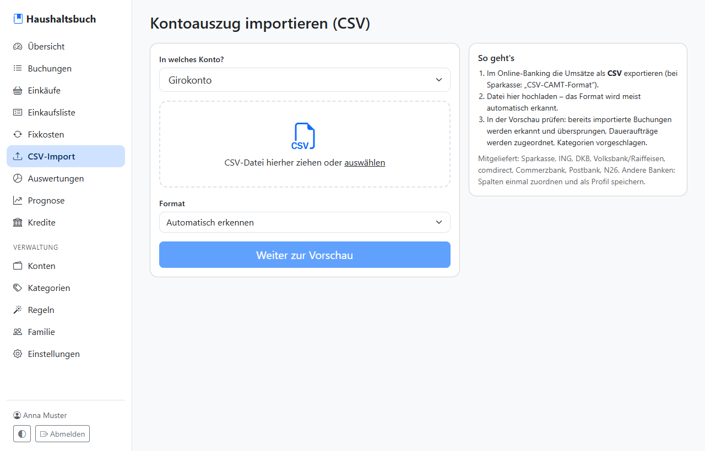

In der **Vorschau** prüfst du jede Zeile, bevor etwas gespeichert wird:

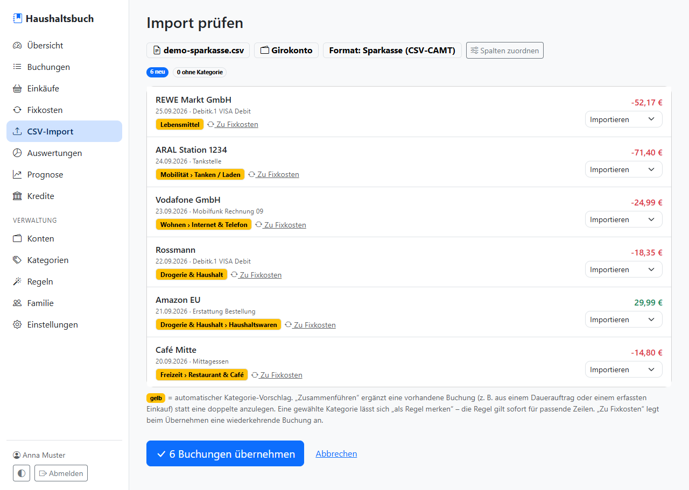

- **Gelb** markierte Kategorien sind Vorschläge. Du kannst sie ändern und mit **Als Regel merken** festlegen, dass
  dieser Empfänger künftig immer so eingeordnet wird.
- Rechts wählst du je Zeile: **Importieren**, **Überspringen** oder **Zusammenführen**. „Zusammenführen“ erscheint, wenn es
  schon eine passende Buchung gibt (z. B. aus einem Dauerauftrag oder einem erfassten Einkauf). Dann wird diese ergänzt statt doppelt angelegt.
- **Als Umbuchung** wird vorgeschlagen, wenn Geld zwischen zwei eigenen Konten wandert. Erkannt wird das an der
  **IBAN des Gegenkontos** (deshalb bei allen Konten die IBAN eintragen) oder – wenn der Kontoauszug keine IBAN
  enthält – an einer genau gegenläufigen Buchung auf einem anderen Konto innerhalb von drei Tagen.
  Steht die Gegenbuchung schon auf dem anderen Konto (z. B. aus dessen Kontoauszug), wird sie verknüpft; sonst wird
  sie dort angelegt und beim späteren Import des anderen Kontos automatisch zusammengeführt.
- Bereits früher importierte Zeilen werden erkannt und übersprungen. Du kannst also überlappende Zeiträume
  bedenkenlos erneut importieren.
- **Zu Fixkosten** legt aus der Zeile gleich eine wiederkehrende Buchung an, z. B. für einen neuen Handyvertrag.

Zum Schluss **… Buchungen übernehmen**.

> Kennt das Haushaltsbuch das Format deiner Bank nicht, ordnest du in der Vorschau über **Spalten zuordnen** einmal zu,
> welche Spalte Datum, Betrag, Empfänger usw. enthält, und speicherst das als Profil.

---

## 6. Einkäufe und Kassenbons

Unter **Einkäufe** hältst du fest, **was** du gekauft hast, nicht nur wie viel. So siehst du später z. B., wie viel
auf Obst oder Süßes entfällt und wie sich der Preis der Milch entwickelt.

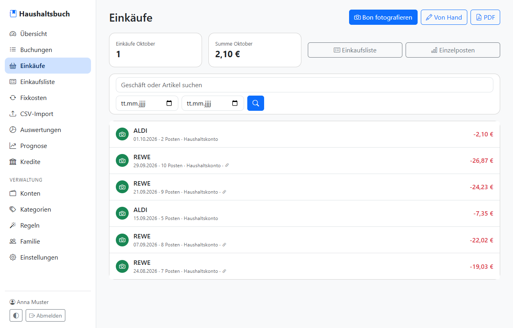

### Kassenbon fotografieren

1. **+ → Bon fotografieren** (oder **Einkäufe → Bon fotografieren**).
2. **Kassenbon fotografieren** öffnet die Kamera. Bei langen Bons mehrere Fotos nacheinander aufnehmen.
   Alternativ **Bild auswählen** für ein vorhandenes Foto.
3. **Erkennen** drücken. Geschäft, Datum, Summe und die einzelnen Posten werden ausgelesen.
   - **Lokal**: Die Erkennung läuft im Browser. Das kostet nichts, und das Foto verlässt das Gerät nicht. Beim ersten
     Mal werden ca. 5 MB Sprachdaten geladen.
   - **KI**: Die Erkennung ist deutlich genauer und schlägt auch Kategorien vor. Das Foto geht dafür an einen KI-Dienst (Claude), was wenige Cent pro Bon kostet.
     Nur verfügbar, wenn der Administrator das eingerichtet hat.
4. Die erkannten Posten **prüfen** und bei Bedarf korrigieren. Weicht die Summe der Posten vom Bon ab, wird das angezeigt.
   Bei der lokalen Erkennung steht oben z. B. „Erkannt: 38 von 47 Posten“. Die Liste folgt dem Bon Zeile für Zeile:
   - **Rot gestrichelt, „Preis?“**: Die Zeile steht auf dem Bon, der Preis war aber nicht lesbar. Darunter steht, was
     gelesen wurde. Preis vom Bon abschreiben – oder die Zeile löschen. Leere Zeilen werden beim Speichern (nach
     Rückfrage) weggelassen.
   - **Gelb umrandeter Preis**: geraten oder auffällig (z. B. 15,00 statt 1,50) – bitte mit dem Bon vergleichen.
5. **Einkauf speichern**.

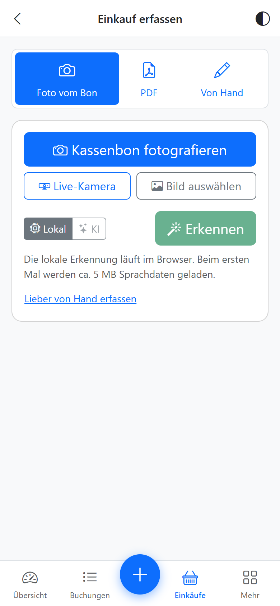

> Die Kamera funktioniert nur, wenn das Haushaltsbuch über **https://** aufgerufen wird.
> Für gute Ergebnisse den Bon glatt auf einen dunklen Untergrund legen und gerade von oben fotografieren.
> Bei langen Bons sollen sich die Fotos etwas überlappen – doppelt erkannte Posten werden automatisch zusammengeführt.

### PDF oder von Hand

- **PDF**: für Online-Rechnungen oder gescannte Belege. Das Einlesen funktioniert wie beim Foto.
- **Von Hand**: Posten mit Namen und Preis eintippen. **Enter** im Preisfeld fügt direkt den nächsten Posten hinzu.
  Du kannst auch ganz ohne Posten nur den Gesamtbetrag erfassen.

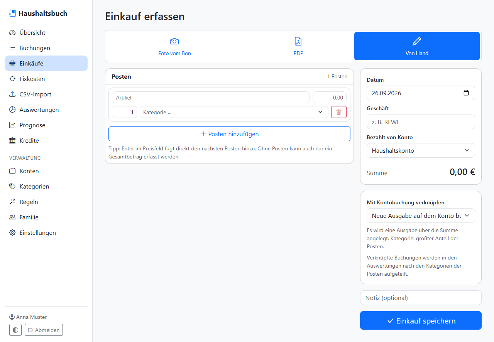

### Mit dem Konto verknüpfen

Unter **Mit Kontobuchung verknüpfen** legst du fest, wie der Einkauf zur Kontobuchung steht:

- **Neue Ausgabe auf dem Konto buchen**: Es wird eine Ausgabe über die Summe angelegt, gut bei Barzahlung.
- **Vorhandene Buchung wählen**: Die Kartenzahlung ist schon da (z. B. aus dem CSV-Import). Passende Buchungen werden vorgeschlagen.
- **Nicht verknüpfen**: Der Einkauf wird nur als Liste festgehalten.

Verknüpfte Buchungen werden in den Auswertungen nach den Kategorien der einzelnen Posten aufgeteilt.
Ein REWE-Einkauf erscheint dann z. B. anteilig unter Lebensmittel und Drogerie.

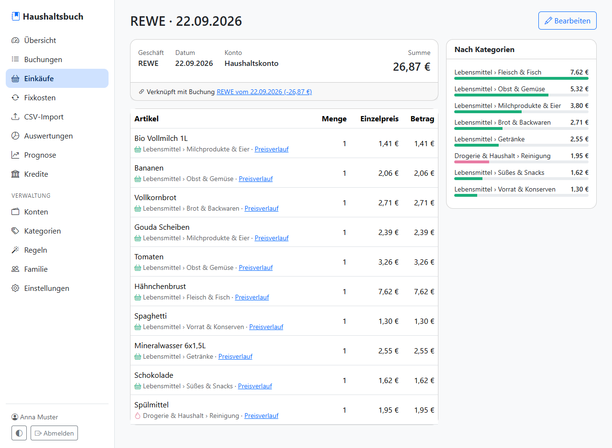

Die Kategorie jedes Artikels merkt sich das Haushaltsbuch. Beim nächsten Einkauf wird „Bananen“ automatisch als
„Obst & Gemüse“ vorgeschlagen. Über **Preisverlauf** siehst du, was ein Artikel wann gekostet hat.

---

## 7. Fixkosten und Daueraufträge

Unter **Fixkosten** stehen alle regelmäßigen Zahlungen: Miete, Strom, Versicherungen, Abos, Gehalt, Kindergeld,
Sparraten usw.

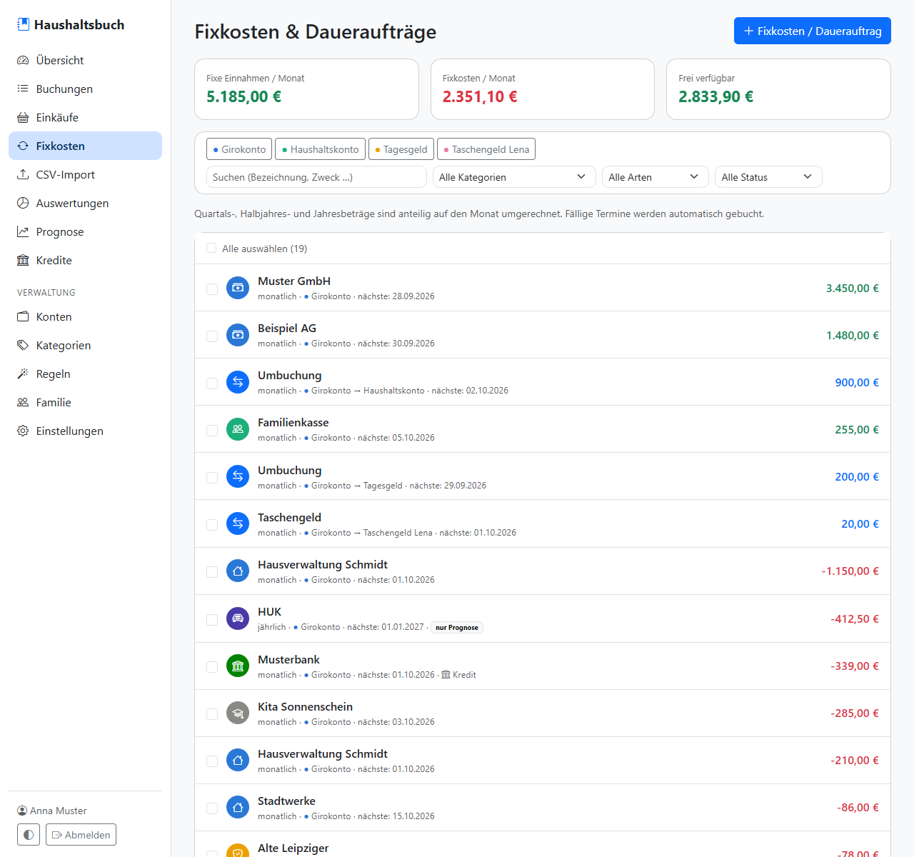

Oben siehst du die **fixen Einnahmen**, die **Fixkosten pro Monat** und was **frei verfügbar** bleibt. Vierteljährliche und
jährliche Beträge werden dafür auf den Monat umgerechnet.

**Neu anlegen:** **+ Fixkosten / Dauerauftrag**. Dort Art, Betrag, Bezeichnung, Konto, Kategorie, **Intervall**
(monatlich, vierteljährlich, halbjährlich, jährlich) und **erste Fälligkeit** eingeben. Der Tag der ersten Fälligkeit ist
der Buchungstag. Bei „31.“ wird in kürzeren Monaten der Monatsletzte genommen.

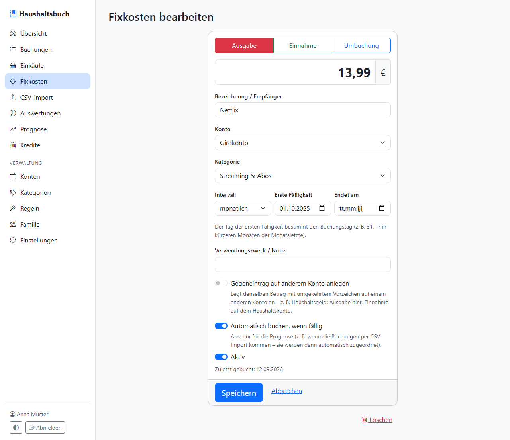

- **Automatisch buchen, wenn fällig**: Das Haushaltsbuch legt die Buchung am Fälligkeitstag selbst an.
  Schalte das **aus**, wenn die Umsätze ohnehin per CSV-Import kommen. Dann dient die Vorlage nur der Prognose, und
  importierte Buchungen werden ihr automatisch zugeordnet.
- **Aktiv** aus = pausiert (z. B. gekündigtes Abo). Mit **Endet am** hört eine Zahlung zu einem Datum auf.
- **Gegeneintrag auf anderem Konto anlegen**: Legt denselben Betrag mit umgekehrtem Vorzeichen auf einem anderen Konto
  an, z. B. Haushaltsgeld: Ausgabe auf dem Gehaltskonto, Einnahme auf dem Haushaltskonto.

Auch hier gibt es Filter und Häkchen für **Sammelaktionen** (nur Prognose / automatisch, pausieren, anderem Konto
zuweisen). Buchungen, die zu Fixkosten gehören, sind in der Buchungsliste gekennzeichnet.

---

## 8. Kategorien und Regeln

### Kategorien

Kategorien gibt es in zwei Ebenen, z. B. **Lebensmittel › Obst & Gemüse**. Sie gelten für Buchungen und für
Einkaufsposten. Ein Standardsatz ist bereits angelegt. Administratoren können Kategorien umbenennen, einfärben, neue
anlegen (**+** neben einer Hauptkategorie für eine Unterkategorie) und löschen.

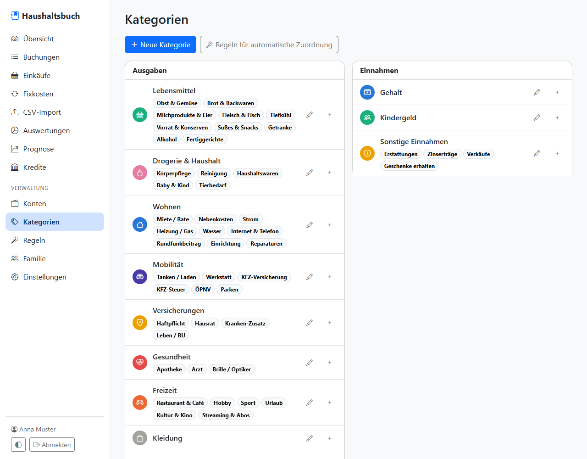

Beim Bearbeiten einer Kategorie gibt es die Option **„In der Prognose ausklammern“**. Sie ist für Einmaliges gedacht,
etwa eine neue Waschmaschine oder den Urlaub, das die Prognose sonst verzerren würde (siehe [Prognose](#10-prognose)).

### Wie Kategorien automatisch vergeben werden

Bei jeder neuen Buchung und jedem Einkaufsposten schlägt das Haushaltsbuch eine Kategorie vor, in dieser Reihenfolge:

1. **Eigene Regeln** (siehe unten),
2. **Gelerntes**: Was du beim gleichen Empfänger oder Produkt schon einmal gewählt hast,
3. **Eingebaute Stichwörter** (z. B. „Aral“ → Tanken, „dm“ → Drogerie).

Korrigierst du einen Vorschlag, merkt sich das Haushaltsbuch die Korrektur.

### Regeln

Unter **Regeln** legst du fest: *Wenn Empfänger/Zweck/Artikel … enthält / genau ist / beginnt mit …, dann Kategorie …*.
Bei mehreren passenden Regeln gewinnt die mit der kleinsten Priorität. **Auf Buchungen ohne Kategorie anwenden**
ordnet mit den Regeln nachträglich alle noch offenen Buchungen zu.

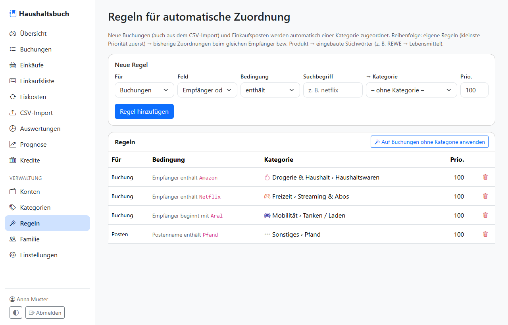

---

## 9. Auswertungen

Unter **Auswertungen** siehst du, wofür das Geld ausgegeben wird.

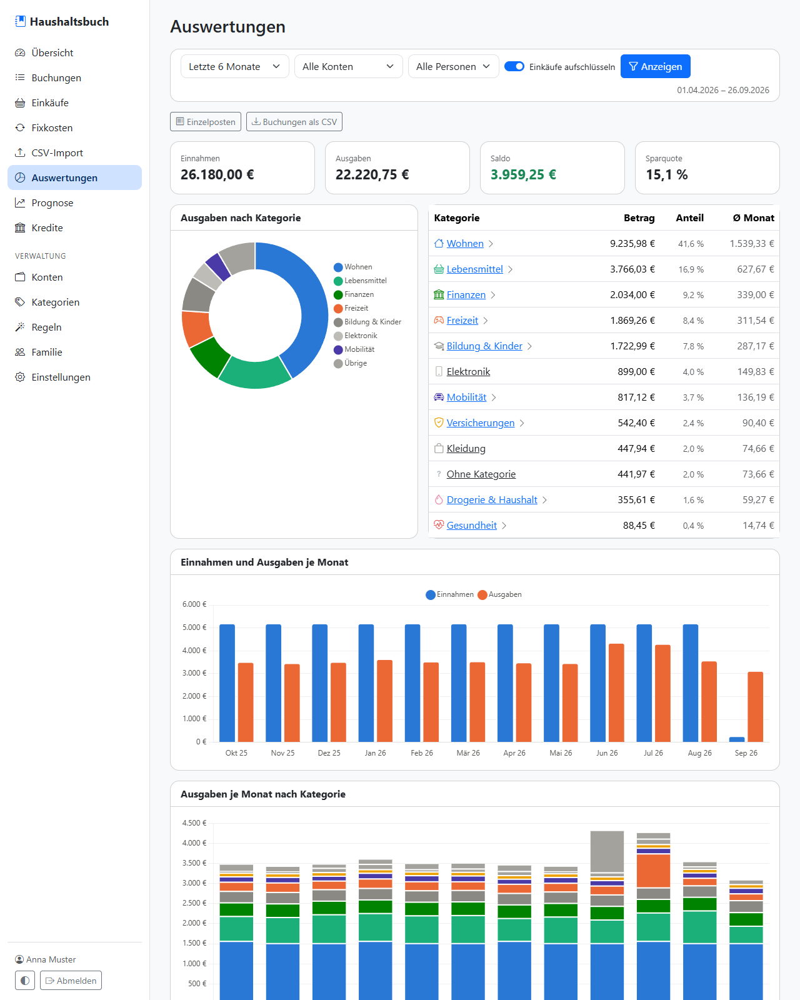

- Oben **Zeitraum**, **Konten** und **Person** wählen und **Anzeigen** drücken.
- **Einkäufe aufschlüsseln**: Verknüpfte Einkäufe werden nach ihren Posten aufgeteilt statt als Ganzes gezählt.
- **Einnahmen, Ausgaben, Saldo und Sparquote** für den Zeitraum.
- **Ausgaben nach Kategorie** als Ring und Tabelle. Eine Kategorie anklicken zeigt ihre Unterkategorien, von dort
  geht es zu den einzelnen Buchungen.
- **Einnahmen und Ausgaben je Monat** und **Ausgaben je Monat nach Kategorie** zeigen den Verlauf.
- **Buchungen als CSV** lädt die Buchungen des Zeitraums für Excel herunter.

Umbuchungen zwischen eigenen Konten zählen normalerweise nicht mit. Filterst du auf einzelne Konten, zählen sie als
Einnahme bzw. Ausgabe (eigene Zeile „Umbuchungen“), damit die Bilanz dieses Kontos stimmt.

### Einzelposten

**Einzelposten** (Knopf oben bzw. **Mehr → Einzelposten**) wertet die Einkäufe nach Artikeln aus: wie oft gekauft,
Durchschnittspreis, günstigster und teuerster Preis. Ein Artikel anklicken zeigt seinen **Preisverlauf**.

Unter dem Filter steht der **Kategorie-Pfad** mit der Summe aller gefundenen Posten. Ein Klick auf „Alle Kategorien“,
die Hauptkategorie oder den Pfeil links führt eine Ebene höher. In einer Hauptkategorie erscheinen ihre
Unterkategorien grau darunter (mit Summe) – ein Klick filtert darauf. Die Auswahl **Ohne Kategorie** im Filter zeigt
Posten, denen noch keine Kategorie zugeordnet ist.

**Kategorie korrigieren:** Steht ein Artikel in der falschen Kategorie, auf die Kategorie unter dem Artikelnamen
(mit dem Stift) tippen, die richtige wählen und **Speichern**. Das ändert alle Käufe dieses Artikels und merkt sich die
Kategorie für künftige Einkäufe.

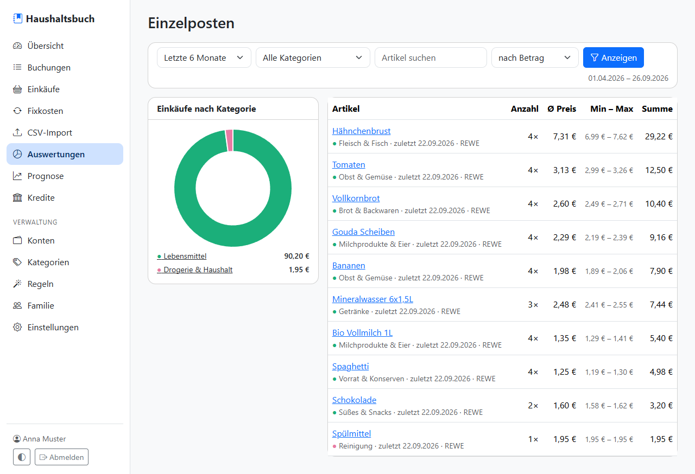

---

## 10. Prognose

Die **Prognose** zeigt, wie sich die Kontostände in den nächsten 3 bis 36 Monaten voraussichtlich entwickeln.

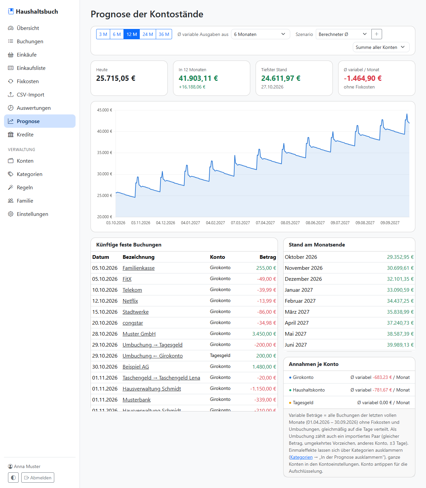

So wird gerechnet:

- Ausgangspunkt ist der **Kontostand heute**.
- Dazu kommen alle **Fixkosten** an ihren Terminen (Liste „Künftige feste Buchungen“).
- Alles Übrige, also Einkäufe, Tanken, Freizeit usw., fließt als **Durchschnitt der letzten Monate** ein
  („Ø variabel / Monat“, einstellbar: aus wie vielen Monaten).

Im Diagramm siehst du den Verlauf, rechts den **Stand am Monatsende**. Rutscht der Gesamtsaldo voraussichtlich ins Minus,
warnt die Prognose mit einem roten Hinweis. Über das Auswahlfeld rechts oben kannst du statt der Summe einzelne Konten ansehen.
Unter **Annahmen je Konto** steht, welcher Durchschnitt verwendet wird. Ein Klick darauf zeigt die Aufschlüsselung.

> Verzerrt eine einmalige große Ausgabe den Durchschnitt, die Kategorie unter **Kategorien** mit
> „In der Prognose ausklammern“ markieren. Kreditraten zählen nur mit, wenn sie als Fixkosten angelegt sind (siehe [Kredite](#11-kredite)).

### Szenarien: „Was wäre, wenn …?“

Mit **+** neben **Szenario** legst du ein Szenario an, z. B. „Sparsamer Monat“. Darin trägst du je Konto einen
eigenen Monatswert für die variablen Ausgaben ein. Ein leeres Feld heißt: Es gilt der berechnete Durchschnitt.
Wählst du das Szenario aus, läuft der berechnete Durchschnitt als gestrichelte Vergleichslinie mit.

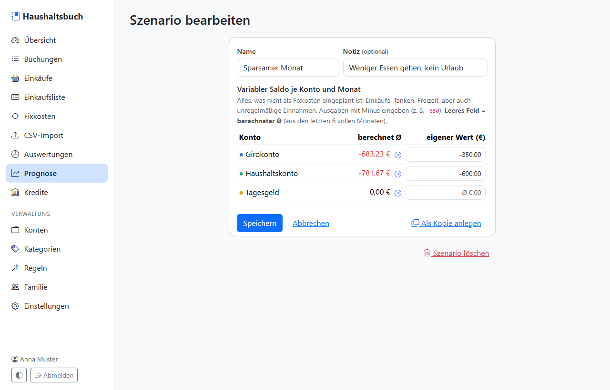

---

## 11. Kredite

Unter **Kredite** verwaltest du Darlehen (Annuitäten- oder Tilgungsdarlehen) mit Zinssatz, Rate, Auszahlung und
erster Rate.

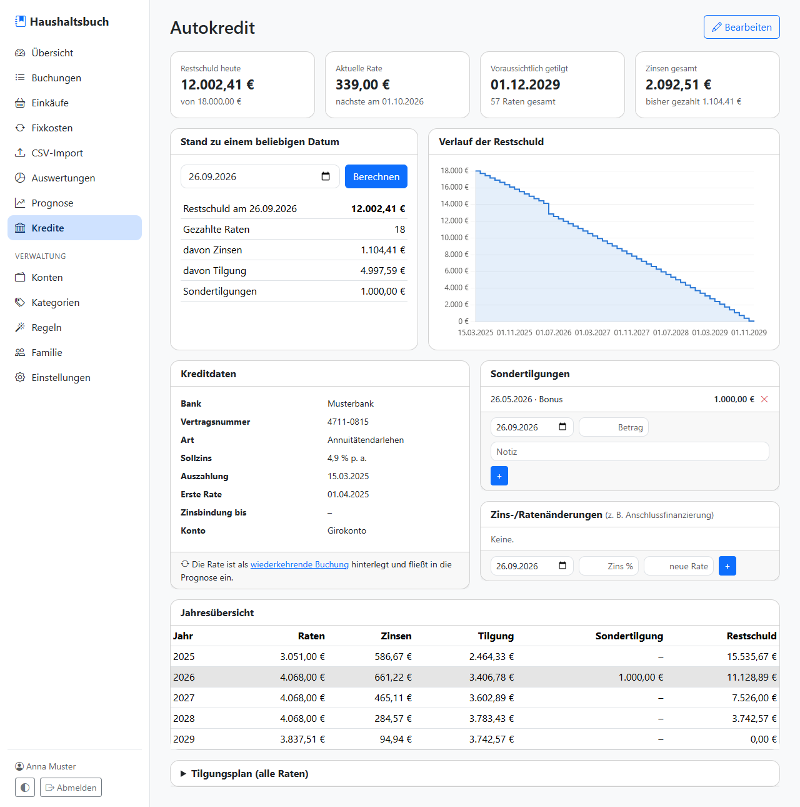

- **Stand zu einem beliebigen Datum**: Datum wählen und **Berechnen** zeigt die Restschuld zu diesem Tag sowie die bis
  dahin gezahlten Zinsen und die Tilgung.
- **Sondertilgungen** und **Zins-/Ratenänderungen** (z. B. Anschlussfinanzierung nach Ende der Zinsbindung)
  werden mit Datum eingetragen und sofort in Plan, Diagramm und Jahresübersicht eingerechnet.
- **Tilgungsplan (alle Raten)** zeigt jede einzelne Rate.
- **Rate als Fixkosten anlegen** legt die monatliche Rate als wiederkehrende Buchung an. So fließt sie in die Prognose ein.

---

## 12. Für Administratoren: Konten, Familie, Einstellungen

### Ersteinrichtung

Beim allerersten Aufruf führt das Haushaltsbuch durch die Einrichtung: Haushaltsname, dein Administrator-Zugang und
das erste Konto. Danach geht es mit den folgenden Schritten weiter.

### Konten

Unter **Konten** legst du Girokonten, Sparkonten, Bargeld, Kreditkarten usw. an.

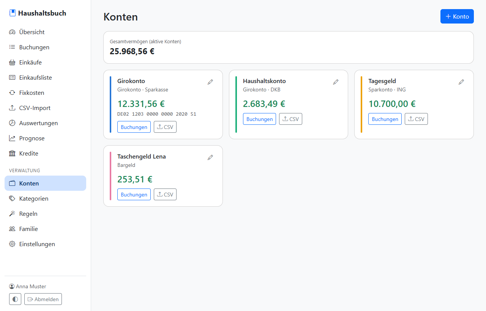

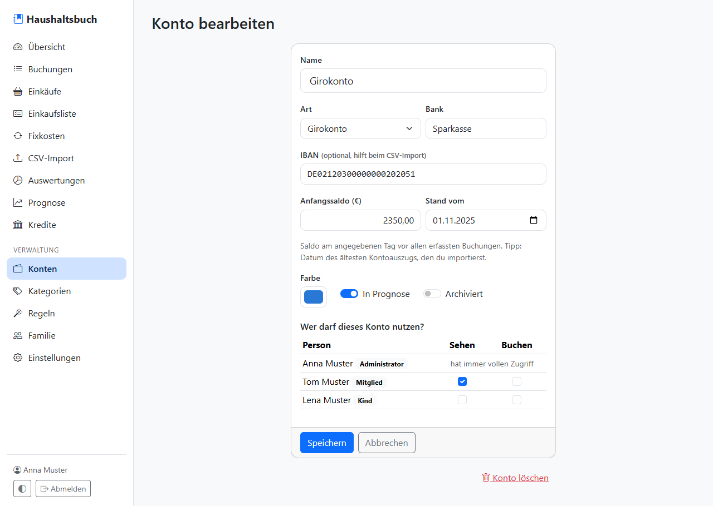

- **Anfangssaldo** und **Stand vom**: der Kontostand am angegebenen Tag *vor* allen erfassten Buchungen. Am besten das
  Datum des ältesten Kontoauszugs nehmen, den du importierst.
- **IBAN** hilft beim CSV-Import. **Farbe**: So erscheint das Konto in Listen und Diagrammen.
- **In Prognose** aus: Das Konto wird in der Prognose nicht berücksichtigt (z. B. Taschengeld der Kinder).
- **Archiviert**: Das Konto wird ausgeblendet, die Buchungen bleiben erhalten. Konten mit Buchungen werden nicht
  gelöscht, sondern nur archiviert.
- **Wer darf dieses Konto nutzen?**: je Person **Sehen** und **Buchen** freigeben. Administratoren haben immer vollen Zugriff.

### Familie

Unter **Familie** legst du weitere Personen an (Name, E-Mail als Anmeldename, Passwort, Rolle) und gibst ihnen Konten frei.
**Aktiv** aus sperrt den Zugang, ohne etwas zu löschen. Das Passwort einer Person setzt du hier neu, wenn sie es vergessen hat.

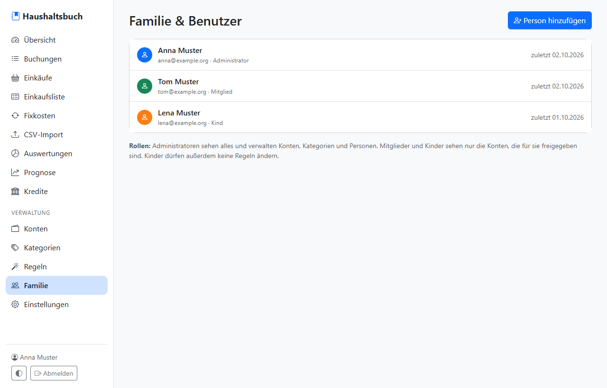

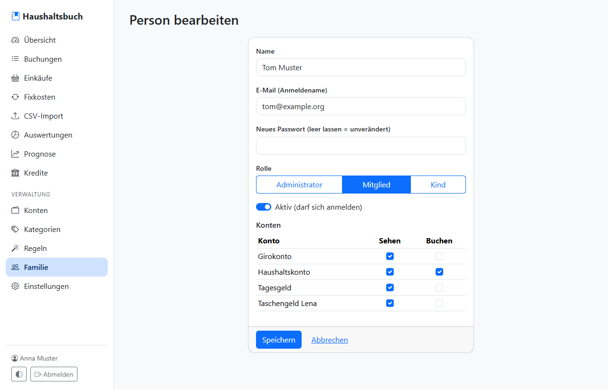

### Einstellungen

- **Name** des Haushalts.
- **Kassenbon- und PDF-Erkennung**: *Lokal im Browser* (kostenlos, ungenauer) oder *KI (Claude)*. Die KI braucht einen
  API-Schlüssel von console.anthropic.com und kostet wenige Cent pro Bon. Beim Einlesen kann trotzdem jederzeit
  gewechselt werden.
- **Prognose**: Standard-Zeitraum und aus wie vielen Monaten der Durchschnitt gebildet wird.

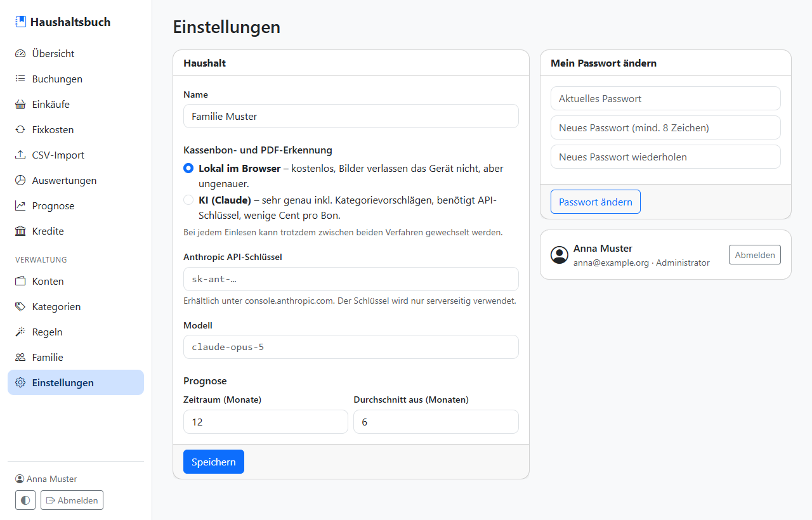

---

## 13. Häufige Fragen

**Muss ich Fixkosten jeden Monat selbst buchen?**
Nein. Fällige Fixkosten mit „Automatisch buchen“ werden beim ersten Öffnen des Haushaltsbuchs am Tag selbst gebucht.

**Ich habe einen Kontoauszug doppelt importiert, gibt es jetzt alles zweimal?**
Nein. Bereits importierte Zeilen werden erkannt und übersprungen.

**Ich importiere die Auszüge von Girokonto und Tagesgeld. Zählt eine Umbuchung dazwischen doppelt?**
Nein. Beim ersten Import wird sie als Umbuchung angelegt (beide Seiten), beim Import des anderen Kontos wird dessen
Zeile mit der schon vorhandenen Seite zusammengeführt. Am zuverlässigsten klappt das, wenn bei beiden Konten die IBAN
eingetragen ist.

**Eine Buchung aus dem Import und ein fotografierter Kassenbon betreffen denselben Einkauf. Zählt er doppelt?**
Nicht, wenn beide verknüpft sind. Beim Speichern des Einkaufs „Vorhandene Buchung wählen“ nehmen oder beim
Import „Zusammenführen“.

**Die Kategorie-Vorschläge passen nicht.**
Einfach die richtige Kategorie wählen. Das Haushaltsbuch lernt daraus. Für feste Zuordnungen eine Regel anlegen.

**Die Prognose wirkt zu hoch oder zu niedrig.**
Unter **Annahmen je Konto** prüfen, welcher Durchschnitt verwendet wird. Einmalige Ausgaben über ihre Kategorie
ausklammern, fehlende Fixkosten anlegen oder ein Szenario mit eigenen Werten nutzen.

**Kann ich auch den dunklen Modus nutzen?**
Ja, über das Symbol ◐ (am Computer unten links, am Handy oben rechts).

**Ich sehe ein Konto nicht.**
Es ist für dich nicht freigegeben. Ein Administrator kann das unter **Konten** oder **Familie** ändern.
